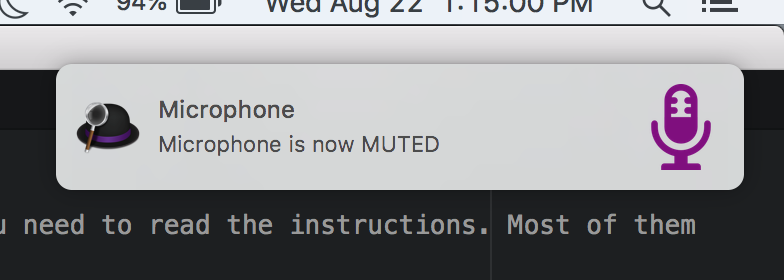
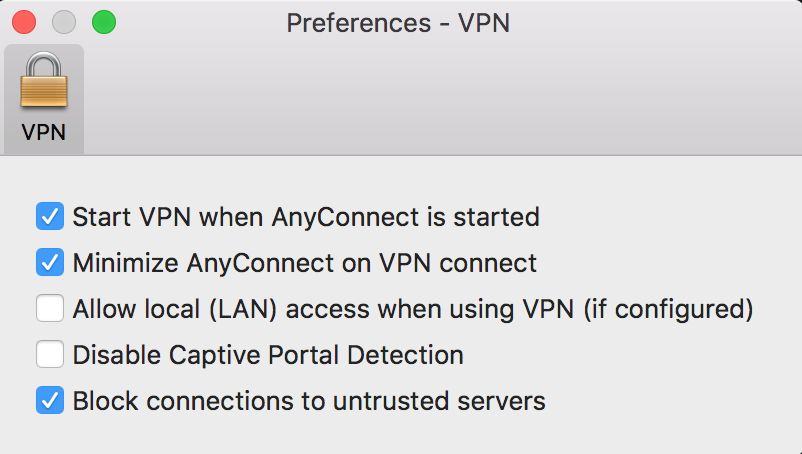

# Intro

These are workflows I have created which I find useful. Please do use them, BUT (!!!) you need to read the instructions. Most of them require some extra setup outside of just importing the Alfred workflow.

# Microphone Mute Toggle

## What it does

This workflow allows you to mute and un-mute your microphone with the press of a hotkey, regardless of what application is open.

This is useful if you have a Zoom call in the background while you multi-task in another application, but still need to turn your microphone on and off.

## Setup

This one is easy - just import the workflow.

## Use

Press Cmd+Ctrl+Option+K. You will see a message pop up like this:



# Cisco VPN Auto-push

## What it does

This workflow automates the process of reconnecting your VPN. It opens Cisco VPN, types "push" as the password, and presses Enter. This allows you to reconnect your VPN without ever taking your hands off the keyboard.

## Setup

Open your Cisco VPN settings by pulling up the UI, clicking the App name in the top bar and choosing preferences. Set them as such:



...then import the workflow.

## Use

Press your Alfred shortcut keys and type "cv" (as in "connect VPN") as keyword.

# Bitly link shortener

## What it does

Takes the selected text (in any app) and turns it into a short bitly URL, which is copied to your clipboard.

## Setup

1. `brew install jq` if you haven't already
1. Import the workflow
1. Test it by pressing Cmd+Ctrl+Option+B
    1. You should see an error message about credentials
1. Get your bitly login and API key from http://bitly.com/a/your_api_key
    1. Note that you can use your Google account to log in
1. Create a file at `~/.bitly_credentials` with content:

    ```
    {
      "bitly_login": "o_1l6s91246k",
      "bitly_apikey": "R_ce4ec42897804f69996a7d82332be782"
    }
    ```
1. Replace the login and API key in that file with yours that you obtained earlier
1. Test it again and see if it works with a real URL

## Use

Press Cmd+Ctrl+Option+B while you have a valid URL highlighted. If it succeeds, you will see no error and have the bitly shortened URL on your clipboard, ready to Paste.

Alternatively, use the "shorten" keyword in Alfred.
