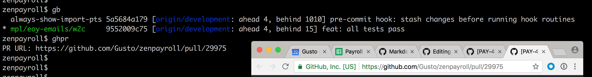
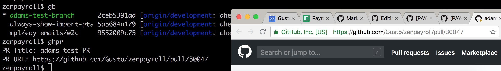

# Bash Customizations

# ghpr *(github pull request)*

What just happened? I was chilling on a local branch called `mpl/eoy-emails/w2c` which tracked upstream branch `origin/development`. Then I ran `ghpr` and it auto-magically found the PR for this branch, echoed the URL, and opened the PR in my browser.

If I do the same thing with a branch that doesn't have a PR yet...

Then it asks me to enter a PR title, creates the PR and opens it in browser!

### Setup

`source` `ghpr.sh` somewhere in your `.bash_profile` or `.bashrc` where it'll get picked up when you start a terminal. Set your `ghtoken` within the file. Get it [here](https://github.com/settings/tokens).

Install `jq` with `brew install jq` and make sure it ends up in your PATH. `jq` is a command line utility to work with JSON.

Try it with `ghpr` while on a branch. Note that I haven't invested much into error checking - it's usually pretty obvious why something went wrong, for example if you're not in a git repo or not on a branch.

**Assumptions ghpr makes:**

* you want to push to the remote called `origin`
* your local branch tracks the upstream branch that you want to merge code into
    * i.e. if you want your code to get merged into `origin/development`, your local branch needs to track `origin/development`
* the name of your local branch matches the name you pushed it to in the remote repo
    * i.e. local branch `fix-for-119` is pushed to `origin` as `origin/fix-for-119`
